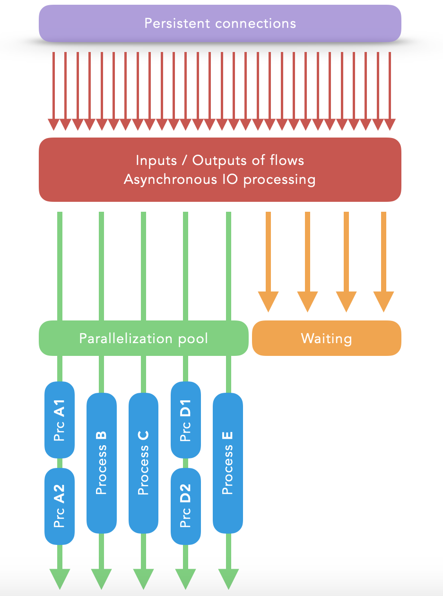

## XAsyncSockets is an efficient Python/MicroPython library of managed asynchronous sockets.

#### Very easy to integrate and very light with one file only :
- `"XAsyncSockets.py"`

#### XAsyncSockets features :
- Managed asynchronous sockets in a pool (up to thousands!)
- Works directly with I/O to receive and send very quickly
- Supports very large number of simultaneous TCP connections
- Supports concurrent synchronous processing operations if necessary (threaded)
- Implementation of TCP servers
- Implementation of TCP clients
- Implementation of UDP datagrams (sender and/or receiver)
- TCP client can event after a specified size of data or a text line received
- Each connections and receivings can waiting during a specified time
- The reasons of TCP client closures are returned
- Really robust, very fast and easy to use
- Compatible with MicroPython implementation (sockets layer, FiFo queue, perf counter)

    

### *XAsyncSockets* classes :

| Class name | Description |
| - | - |
| XAsyncSocketsPool | Managed pool of 'XAsyncSocket' objects |
| XClosedReason | Enumerator of 'XAsyncSocket' closing reasons |
| XAsyncSocket | Abstract class of managed asynchronous sockets |
| XAsyncTCPServer | TCP server implementation of 'XAsyncSocket' |
| XAsyncTCPClient | TCP client implementation of 'XAsyncSocket' |
| XAsyncUDPDatagram | UDP sender/recever implementation of 'XAsyncSocket' |
| XBufferSlot | Managed buffer |
| XBufferSlots | Managed buffers collection |
| XFiFo | Dedicated FiFo queue |

### *XAsyncSockets* exceptions :

| Class name | Description |
| - | - |
| XAsyncSocketsPoolException | Exception class for 'XAsyncSocketsPool' |
| XAsyncSocketException | Exception class for 'XAsyncSocket' |
| XAsyncTCPServerException | Exception class for 'XAsyncTCPServer' |
| XAsyncTCPClientException | Exception class for 'XAsyncTCPClient' |
| XAsyncUDPDatagramException | Exception class for 'XAsyncUDPDatagram' |
| XFiFoException | Exception class for 'XFiFo' |

### *XAsyncSocketsPool* class details :

| Method | Arguments |
| - | - |
| Constructor | None |
| GetAllAsyncSockets | None |
| GetAsyncSocketByID | `id` (int) |
| AsyncWaitEvents | `threadsCount=0` (int) |
| StopWaitEvents | None |

( Do not call directly the methods `AddAsyncSocket`, `RemoveAsyncSocket`, `NotifyNextReadyForReading` and `NotifyNextReadyForWriting` )

### *XClosedReason* class details :

| Static variable | Value |
| - | - |
| Error | 0x00 |
| ClosedByHost | 0x01 |
| ClosedByPeer | 0x02 |
| Timeout | 0x03 |

### *XAsyncSocket* class details :

| Method | Arguments |
| - | - |
| GetAsyncSocketsPool | None |
| GetSocketObj | None |
| Close | None |

| Property | Details |
| - | - |
| SocketID | Get the opened socket unique ID |
| OnClosed | Get or set an event of type f(closedReason) |
| State | Get or set a custom object |

### *XAsyncTCPServer* class details :

| Method | Arguments |
| - | - |
| Create (static) | `asyncSocketsPool`, `srvAddr` (tuple of ip and port), `srvBacklog=256` (int), `recvBufSlots=None` |

| Property | Details |
| - | - |
| SrvAddr | Tuple of ip and port |
| OnClientAccepted | Get or set an event of type f(xAsyncTCPServer, xAsyncTCPClient) |

### *XAsyncTCPClient* class details :

| Method | Arguments |
| - | - |
| Create (static) | `asyncSocketsPool`, `srvAddr`, `connectTimeout=5` (int), `recvbufLen=4096` (int) | `connectAsync=True` (bool) |
| AsyncRecvLine | `onDataRecv=None` (function), `onDataRecvArg=None` (object)`, timeoutSec=None` (int) |
| AsyncRecvData | `size=None` (int), `onDataRecv=None` (function), `onDataRecvArg=None` (object), `timeoutSec=None` (int) |
| AsyncSendData | `data` (bytes or buffer protocol), `onDataSent=None` (function), `onDataSentArg=None` (object) |
| StartSSL | `keyfile=None`, `certfile=None`, `server_side=False`, `cert_reqs=ssl.CERT_NONE`, `ca_certs=None` |
| StartSSLContext | `sslContext`, `serverSide=False` |
- `onDataRecv` is a callback event of type f(xAsyncTCPClient, data, arg)
- `onDataSent` is a callback event of type f(xAsyncTCPClient, arg)
- `StartSSL` and `StartSSLContext` doesn't works on MicroPython (in asynchronous non-blocking sockets mode)
- It is widely recommended to use `StartSSLContext` rather than `StartSSL` (old version)

| Property | Details |
| - | - |
| SrvAddr | Tuple of ip and port |
| CliAddr | Tuple of ip and port |
| IsSSL | Return True if SSL is used |
| OnFailsToConnect | Get or set an event of type f(xAsyncTCPClient) |
| OnConnected | Get or set an event of type f(xAsyncTCPClient) |

### *XAsyncUDPDatagram* class details :

| Method | Arguments |
| - | - |
| Create (static) | `asyncSocketsPool`, `localAddr=None` (tuple of ip and port), `recvbufLen=4096` (int), `broadcast=False` (bool) |
| AsyncSendDatagram | `datagram` (bytes or buffer protocol), `remoteAddr` (tuple of ip and port), `onDataSent=None` (function), `onDataSentArg=None` (object) |
- onDataSent is a callback event of type f(xAsyncUDPDatagram, arg)

| Property | Details |
| - | - |
| LocalAddr | Tuple of ip and port |
| OnRecv | Get or set an event of type f(xAsyncUDPDatagram, remoteAddr, datagram) |
| OnFailsToSend | Get or set an event of type f(xAsyncUDPDatagram, datagram, remoteAddr) |

### *XBufferSlot* class details :

| Method | Arguments |
| - | - |
| Constructor | `size` (int), `keepAlloc=True` (bool) |

| Property | Details |
| - | - |
| Available | Get or set the availability of the slot |
| Size | Get the buffer size of the slot |
| Buffer | Get the buffer of the slot |

### *XBufferSlots* class details :

| Method | Arguments |
| - | - |
| Constructor | `slotsCount` (int), `slotsSize` (int), `keepAlloc=True` (bool) |
| GetAvailableSlot | None |

| Property | Details |
| - | - |
| SlotsCount | Get the number of slots |
| SlotsSize | Get the buffer size of each slots |
| Slots | Get the list of slots |

### *XFiFo* class details :

| Method | Arguments |
| - | - |
| Constructor | None |
| Put | `obj` (object) |
| Get | None |
| Clear | None |

| Property | Details |
| - | - |
| Empty | Return True if the FiFo is empty |

### By JC`zic for [HC²](https://www.hc2.fr) ;')

*Keep it simple, stupid* :+1:
